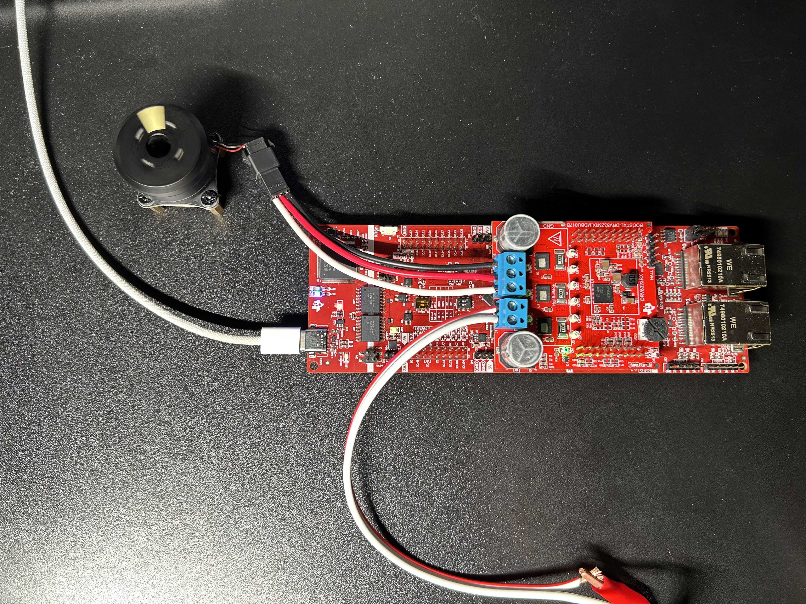
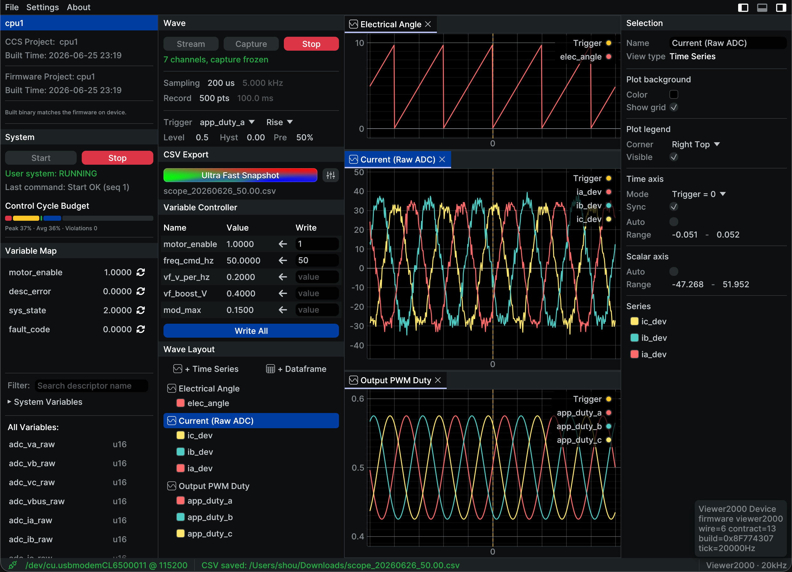

# Viewer2000

**A rapid control-prototyping platform for motors on the dual-core C2000 (F28P65x).**


<table>
<tr>
<td width="50%"></td>
<td width="50%"></td>
</tr>
</table>

*Left — the supported kit: a **LAUNCHXL-F28P65X + BOOSTXL-DRV8323RX** power stage driving
a PMSM with an AS5600 encoder. Right — that same board's open-loop V/f run streamed live
into **Scope2000**: electrical angle, three-phase currents, and three-phase PWM duty —
every trace a plain C variable straight out of `control()`.*

Write your motor-control loop the way you'd write Arduino — a `setup()` and a
`control()` over a flat I/O struct — and watch every variable inside it live, at
control-loop rates, in the companion [Scope2000](https://github.com/elechou/Scope2000)
host viewer. The platform owns the parts that are tedious and dangerous to get right
(boot, clocks, pinmux, the ePWM→ADC→EOC chain, fault/trip protection, dual-core comms),
so you can spend your time on the control law and nothing else.

## Highlights

- **Arduino-style control loop** — your whole application is `setup()` + `control()`
  over a global `v2k_io`; no boilerplate, no register wrangling.
- **Live, no-reflash observability** — symbol-baking exposes your plain C variables to
  Scope2000 by name; pin, plot, and *write* them at control-loop rate without rebuilding.
- **Deterministic by construction** — the platform owns the ePWM→ADC→EOC chain and calls
  `control()` once per period, so one sample always equals one control cycle.
- **Protection you can't accidentally disable** — hardware trip (TZ/CMPSS) and a fault
  state machine sit beneath your code as a true safety layer.
- **Dual-core isolation** — CPU1 is the control domain, CPU2 the comms domain; comms
  jitter and disconnects can't perturb the loop.
- **Reuse the official ecosystem** — pure C means C2000Ware, the MOTORCONTROL-SDK, and
  DCL drop in directly, the way the TI examples use them.
- **Triggered snapshots & CSV** — pre-trigger history capture and CSV export for offline
  analysis, all from the host viewer.

---

## Write motor control like Arduino

Your entire application is two functions over one global I/O struct:

```c
#include "v2k.h"

// Plain C globals. Symbol-baking exposes them to Scope2000 by name —
// pin them, watch them, scope them, and write to them live, no reflashing.
float    duty   = V2K_DUTY_NEUTRAL;   // 0.50 = neutral
uint16_t ia_raw;

void setup(void) {
    // Runs once after every reset, before control() is ever called.
    duty = V2K_DUTY_NEUTRAL;
}

void control(void) {
    // Runs every control period (e.g. 20 kHz), the instant the ADC frame closes.
    ia_raw = v2k_io.adc.ia_raw;          // a coherent, time-aligned sample
    v2k_pwm_apply(duty, duty, duty);     // submit the three-phase duty command
}
```

That's the whole mental model:

- **`v2k_io.adc`** — the completed, semantic raw ADC frame (phase currents/voltages,
  bus voltage) for *this* control period.
- **`v2k_io.sys`** — platform tick, schedule (`V2K_DUE_1KHZ` / `V2K_DUE_100HZ` for
  sub-rate work), state, and fault code.
- **`v2k_pwm_apply(a, b, c)`** — submit your three-phase duty. Nothing is applied
  implicitly; output is always an explicit call you can see.

There is **no `loop()`** on purpose: `control()` *is* the deterministic ISR body, and
hiding that identity behind a free-running loop would hide the one thing that matters
for control timing. A worked example — low-energy open-loop V/f with current-offset
calibration and frequency slew — ships in [`cpu1/app/user.c`](cpu1/app/user.c).

---

## The hardware

The directly supported, out-of-the-box target is TI's public evaluation kit (pictured
at the top):

| Part | Role |
|---|---|
| **LAUNCHXL-F28P65X** | Dual-core C2000 LaunchPad (control MCU) |
| **BOOSTXL-DRV8323RX** | Three-phase gate-driver + FET booster pack (DRV8323RS) |
| **AS5600** | Magnetic absolute-angle position sensor |

If your bench differs, that's a board-layer change — see the layer map below.

## ⚠️ Safety

This platform drives real power stages and spins real motors. It can source large
currents and switch hazardous voltages.

- Bring up new code at **low bus voltage and low modulation depth**, with a
  **current-limited supply**, before anything energetic.
- Keep clear of rotating parts; mechanically secure the motor.
- The built-in protection (overcurrent trip, fault latch) is a **safety net, not a
  substitute** for a current limit and sound bench practice.
- You are responsible for the safety of your own hardware, wiring, and motor.

---

## Quick start

You'll need [Code Composer Studio](https://www.ti.com/tool/CCSTUDIO), TI's
C2000Ware MOTORCONTROL-SDK, the evaluation kit above, and the
[Scope2000](https://github.com/elechou/Scope2000) host viewer.

1. **Build the firmware.** Import the `cpu1/` and `cpu2/` projects into CCS and build
   both (start with the `RAM` configuration for fast iteration; use `FLASH` for
   standalone boot). The managed build runs SysConfig and bakes your user-variable
   descriptors automatically.
2. **Load and run.** Connect the board over its XDS110 debug probe, load both cores,
   and run.
3. **Observe and tune.** Launch Scope2000 and connect to the board's XDS110 virtual COM
   port. Your baked variables enumerate automatically — pin them, scope them, and write
   to them live.
4. **Make it yours.** Edit `control()` in [`cpu1/app/user.c`](cpu1/app/user.c), rebuild,
   reload — your new variables appear in Scope2000 on the next enumeration.

The full, hardware-verified bring-up procedure (boot, protection, scheduling, scope,
parameter transactions) is in [`BRINGUP.md`](BRINGUP.md) and the phase documents under
[`docs/`](docs/).

---

## The four-layer architecture

Viewer2000 is cut into four layers, each with a single, clean job. The dividing line
runs between **L1 and L2**: the platform owns L0–L1, you own L2–L3.

| Layer | Where | What lives there |
|:--:|---|---|
| **L3** | `cpu1/app/` | `setup()` / `control()`, application state, demo orchestration |
| **L2** | app-owned control modules | Control math & motor semantics: C2000Ware MOTORCONTROL-SDK, DCL, hand-written, or Simulink-generated C |
| **L1** | `cpu1/runtime/` | ISR executor, control-state machine, protection policy, parameter/descriptor registry, RAM scope |
| **L0** | `cpu1/board/` | Boot, memory map, pinmux, ePWM/ADC/CMPSS/TZ/X-BAR substrate, DRV8323RS & AS5600 drivers — on C2000Ware driverlib |

A second CPU runs alongside: **CPU1 is the control domain, CPU2 is the comms domain**
(the SCI dumb-pump today, EtherCAT later). Splitting them isolates fault *and* time
domains — comms jitter and disconnects can never perturb the control loop's
determinism.

### Which layer should *I* edit?

Each layer is sliced so that, in the common case, you only touch the one that matches
your goal:

| If you want to… | Edit | Layer |
|---|---|:--:|
| Run or learn a control law (simple control, FOC, V/f, your own loop) | `cpu1/app/user.c` — `setup()` / `control()` | **L3** |
| Drop in a specific control algorithm | An app-owned control module: pull in C2000Ware MOTORCONTROL-SDK / DCL, or write the math straight into `app/` | **L2** |
| Adapt to a different lab board, wiring, or sensor | `cpu1/board/` (the board profile) | **L0** |
| Change protection levels, or do advanced timing / frequency / scheduling | `cpu1/runtime/` | **L1** |

Most users live entirely in L2–L3 and never open L0 or L1.

---

## Who this platform is for

1. **Researchers** who care only about the motor-control law itself, not the silicon
   bring-up around it.
2. **Students** learning FOC or motor-control algorithms, who want to see the math move
   real currents on a screen.
3. **Embedded beginners** who want to drive a high-performance motor on C2000 without
   first drowning in init code, register setup, and protection plumbing.
4. **Anyone doing quick motor / control-law performance evaluation** — bring-up,
   A/B-ing a controller, characterizing a motor — and wanting answers the same day.
5. **Educators and TAs** who need a reproducible teaching rig where the interesting
   code is small, readable, and the same on every bench.
6. **Algorithm engineers** validating Simulink-generated or hand-written control C on
   real silicon before it ever goes near a product BSP.

## Who this platform is *not* for

1. **People who want to learn C2000 itself / the C2000Ware SDK in depth.** *(This one is
   honestly still evolving.)* We've worked hard to keep the platform compatible with
   C2000Ware and the MOTORCONTROL-SDK, so that you can call the official APIs much like
   the official examples do. But the runtime still **enforces some safety protections**
   that, in certain cases, make an official C2000Ware API ineffective — because the
   platform retains ownership of timing, output release, interrupts, and protection.
   Closing that gap is ongoing work, and compatibility keeps improving.
2. **STM32 (or other non-C2000) users, and non-dual-core users.** The platform assumes a
   dual-core C2000 fault/time-domain split.
3. **People building a shippable motor *product*.** The platform makes later migration
   *off* it painful: it can carry your control algorithm across — but the control
   algorithm is the *small* part of a product. The IO, initialization, and BSP that the
   platform owns for you are exactly the parts you'd have to re-do by hand, and that
   migration is miserable.

---

## FAQ

**Why does CPU1 do the sampling — why not let user code read the ADC whenever it wants?**
> For **timing unity**. The platform owns the ePWM→ADC SOC→EOC chain and calls your
> `control()` only *after* the configured ADC frame has closed. So every sample is taken
> at a fixed point in the period, and **one sample corresponds to exactly one control
> cycle**. Your control law always sees a coherent, time-aligned snapshot instead of an
> arbitrary mid-loop read.

**Arduino is C++ too — why is this pure C?**

> The platform is still simple enough that C++'s benefits don't outweigh its costs here:
>
>- **Observability.** The primary HMI is CCS Expressions/Graph and the Scope2000 watch
>  tree, which read flat C structs directly. C++ name mangling, templates, and private
>  members are all friction in the map file and the watch window.
>- **Reuse over reinvention.** C2000Ware, the MOTORCONTROL-SDK, and DCL are all plain C.
>  Staying in C means you call the official code *directly*, the way the official
>  examples do — instead of wrapping everything in `extern "C"` and fighting the
>  boundary, build-artifact, and linkage problems that come with mixing the two.
>- **CLA option.** The CLA accepts only a C subset; keeping the fast loop in C preserves
>  the option of later moving it onto the CLA.
>- **Audience.** The target users — beginners and motor researchers — speak C. (ODrive's
>  heavy C++ is part of its learning barrier; we're not replicating that.)

If the platform's needs ever outgrow C, this decision gets revisited — but today, C
is the choice that keeps the official ecosystem one include away.

---

## Status & roadmap

Viewer2000 is under **active development** and currently runs on a single hardware
target. Working today, end to end: dual-core boot and IPC, hardware-enforced protection,
multi-rate scheduling, the RAM scope, atomic parameter transactions, SCI streaming to
Scope2000, and an open-loop V/f first-rotation application.

On the roadmap:

- closed-loop FOC user examples on top of the same `setup()`/`control()` surface;
- **EtherCAT** transport alongside SCI (the protocol lives inside the pipe — swapping the
  physical layer doesn't change the service model);
- hardening the L0 board seam so new targets are a single-layer change.

---

## Documentation

- [`docs/wire-spec.md`](docs/wire-spec.md) — the host↔firmware wire protocol (authority)
- [`docs/board-portability.md`](docs/board-portability.md) — the board seam and porting model
- [`docs/protection-architecture.md`](docs/protection-architecture.md) — the protection layer
- [`docs/`](docs/) — per-phase design and bring-up plans
- [`BRINGUP.md`](BRINGUP.md) — the hardware-verified bring-up log and procedure

## Companion host: Scope2000

The screenshots above are [**Scope2000**](https://github.com/elechou/Scope2000), the
Rust + egui host viewer (an independent sibling repository). It enumerates your baked
user variables at runtime, streams `ScopeBlock` data for live monitoring and triggered
snapshots, renders waveforms, and exports CSV — no `.out` parsing or reflashing required
to watch and tune.

## Repository layout

This repository ([`elechou/Viewer2000`](https://github.com/elechou/Viewer2000)) is
**firmware only** — everything flashed into the F28P65x, both cores. The host viewer
lives in the sibling repository
[`elechou/Scope2000`](https://github.com/elechou/Scope2000).

The wire protocol is the design authority and is defined here: [`docs/wire-spec.md`](docs/wire-spec.md),
the headers under [`contracts/`](contracts/), and the golden conformance vectors under
[`contracts/vectors/`](contracts/vectors/). Compatibility with older devices belongs in
a separate out-of-process bridge and must not alter the native Viewer2000 protocol or
data path.

## License

Licensed under either of [Apache License 2.0](LICENSE-APACHE) or
[MIT license](LICENSE-MIT) at your option.

## Acknowledgements

Built on Texas Instruments' C2000Ware, the MOTORCONTROL-SDK, and the Digital Control
Library (DCL), targeting the F28P65x LaunchPad and DRV8323 BoosterPack.

The host viewer is built with [egui](https://github.com/emilk/egui) and
inspired by [rerun](https://github.com/rerun-io/rerun).
